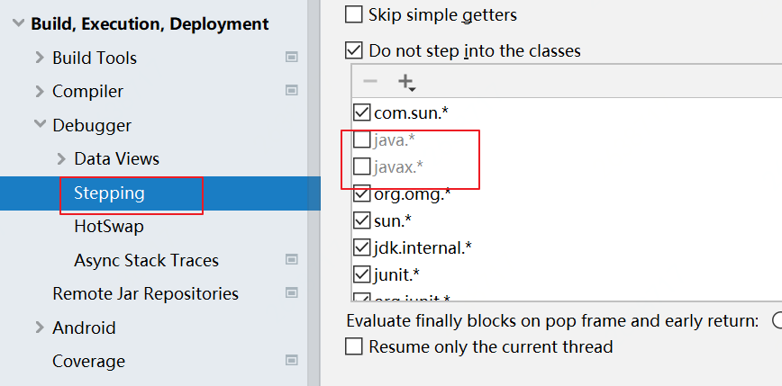
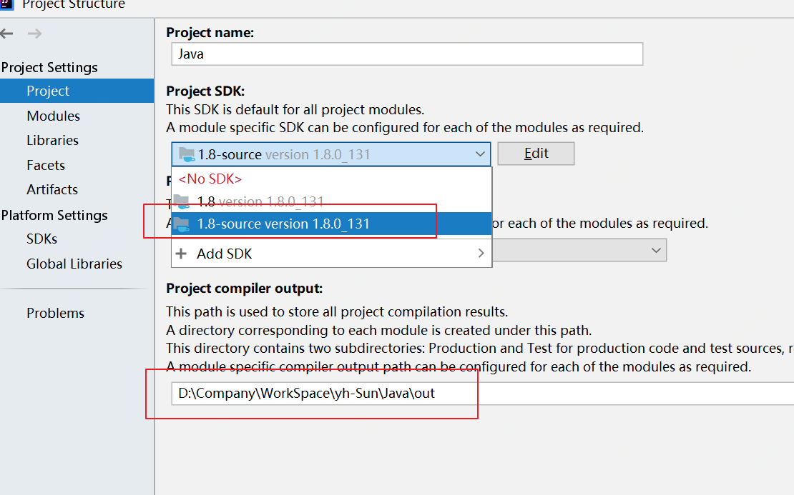
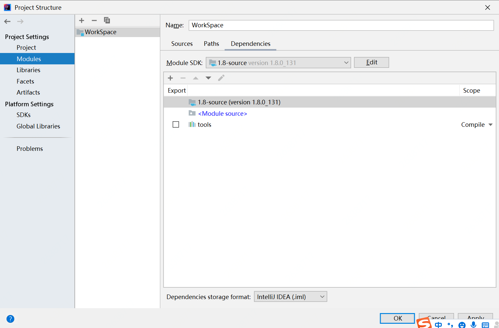
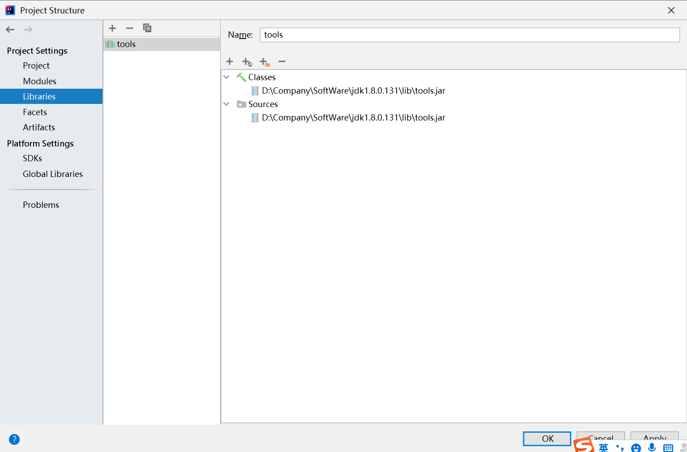
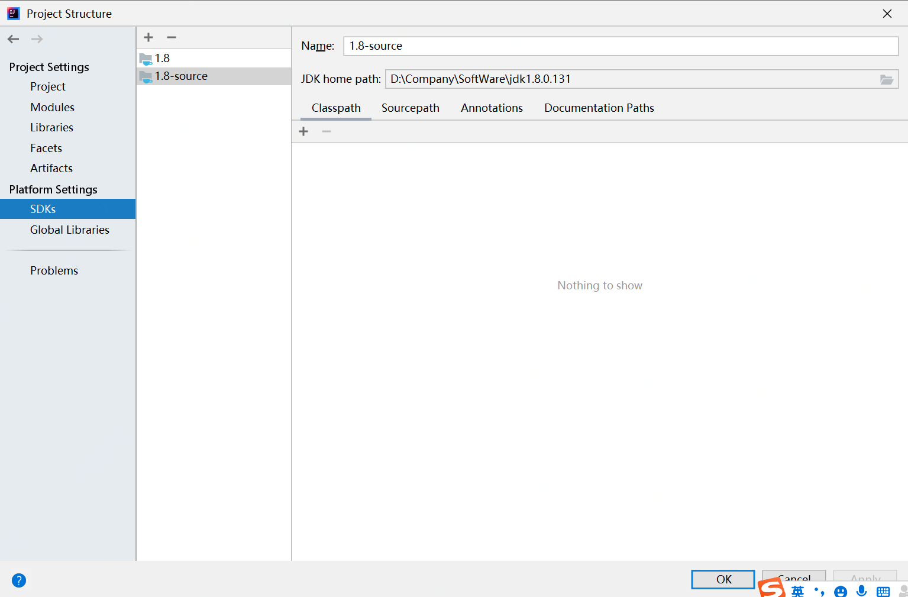
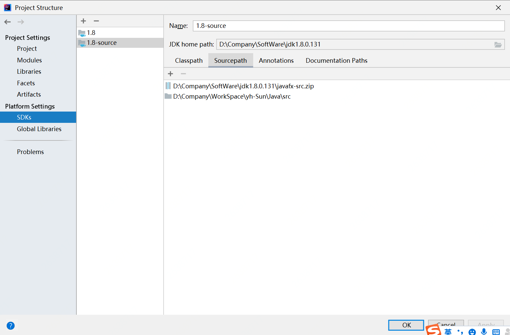

# Source-jdk
> jdk源码调试步骤：
> https://blog.csdn.net/qq_41055045/article/details/112002440
> https://mp.weixin.qq.com/s/Z0yjIGsKtiJxQpUSVoYLXw

## debug调试进不去源码，解决办法：

## 选择jdk-source的SDK，并配置out目录

